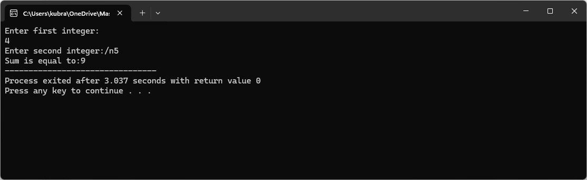

# ele124-homework## My GitHub Pages Website  

You can access my website at the following link:  
[Click here to visit my website]( https://kubrakarakus5.github.io/ele124-homework/)

### QR Code  
Here is the QR code for quick access:  
## Homework Files

- `Hw-Q3.c`: c codes for question Q3
- `Hw-Q3.exe`: output for Q3
- `Hw-Q4a.c`:codes for Q4 (a)
- `Hw-Q4a.exe`:output for Q4a
- `Hw-Q4b.c`:codes for Q4 (b) void 
- `Hw-Q4b.exe`: output for Q4
- `Hw1-Q2.c`:codes for Q2
- `HW1-Q2.exe`:output for Q2

## 📸 Snapshot 

here is the my outputs

### Q2 output:

### Q3 output:
.png)

### Q4a output:
.png)

### Q4b output:
.png)

